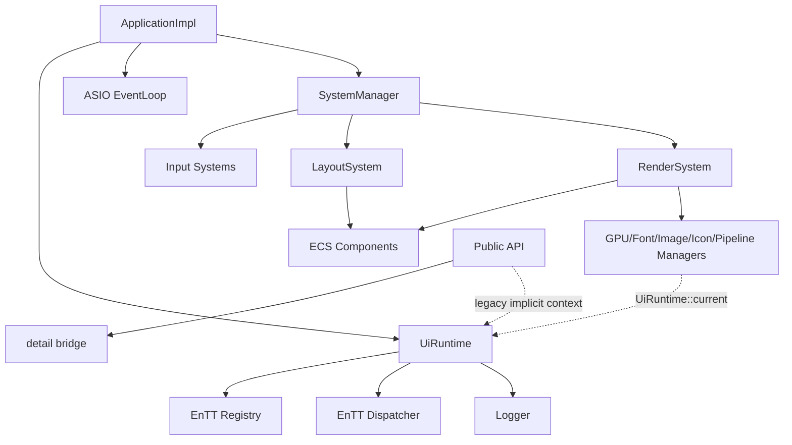
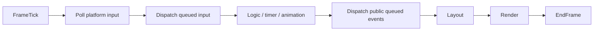
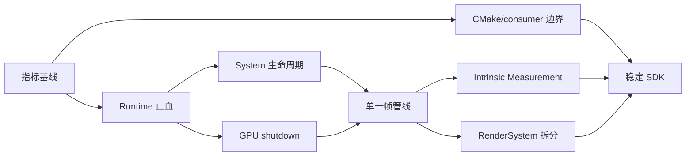

# VMP-ui 架构锐评与演进路线（2026-07-11）

> 状态：建议稿  
> 范围：公开 API、Runtime、事件与帧循环、System、布局、渲染、资源生命周期、CMake、测试与文档治理  
> 原则：先消除确定性风险，再收敛执行模型，最后建设扩展能力。

## 1. 执行摘要

VMP-ui 已越过“Demo 工程”阶段：C++23、ECS、`Result<T>`、GPU RAII、公开实体句柄、测试分组和架构边界检查均已有实质投入。但它仍处在一次未完成的架构迁移中：**表面上从全局单例迁到了 `UiRuntime`，实际依赖图仍大量依靠 `UiRuntime::current()` 这一线程局部 Service Locator。**

最尖锐的评价是：

1. **Runtime 显式化只完成了一半。** System 构造侧开始注入依赖，API、manager、detail、render 等层仍在隐式取全局上下文。
2. **RAII 解决了“谁释放”，没有彻底解决“何时释放”。** GPU deleter 捕获裸 device，资源销毁顺序仍靠人工纪律；代码甚至保留 device 先销毁后主动泄漏缓存的分支。
3. **帧循环不是一条管线，而是多个计时器、队列和即时补救路径的叠加。** System phase 只排序注册，不等于显式执行图。
4. **公开头的隔离方向正确，CMake 却仍把 EnTT 和内部 include 路径向消费者传播。** 源码边界在收，构建边界仍开着。
5. **文档多但状态漂移严重。** 一些计划已部分完成，一些规则仍匹配旧路径；继续堆计划会制造“文档看似治理、实际误导决策”。

当前不应优先扩充控件数量。未来 1～2 个版本的主线应是：**Runtime 生命周期 → 资源 shutdown → 单一帧管线 → 布局测量边界 → SDK/consumer 边界。**

---

## 2. 当前架构判断

### 已经做对的部分

- `include/ui.hpp` 已形成统一公开入口，公开事件与实体句柄开始隔离 EnTT。
- `src/common/Result.hpp` 基于 `std::expected`，错误码、上下文和 `source_location` 设计成熟。
- System 具备 phase 排序，注册模式统一。
- GPU 资源已有 RAII wrapper，不再完全依赖散落的手工 release。
- 测试已拆分 unit/ecs/api，存在公开头和公开事件测试。
- `tools/check_architecture_boundaries.py` 说明项目已认识到“边界需要机器约束”。

### 尚未闭环的部分

- Runtime 既是服务容器、所有者，又是 thread-local locator 和 registry context 宿主。
- 新旧 Factory API 并存，错误模型和 runtime 绑定不同。
- 主 Dispatcher 与公开自定义事件队列是两套系统。
- Layout 与 Render 虽没有直接类依赖，却通过文字估宽、滚动条魔法常量等语义耦合。
- RenderSystem 仍承担事件协调、资源所有权、缓存、管线和提交等过多职责。
- CMake PUBLIC 传播范围与“稳定 SDK 边界”目标不一致。

---

## 3. 风险清单与锐评

## 3.1 P0：初始化失败时可能二次崩溃

**证据：**

- `src/core/UiRuntime.hpp` 的 `current()` 直接解引用当前指针。
- `ApplicationImpl` 构造失败时，已构造成员会析构，Runtime 可能先清空 current。
- `src/api/Factory.cpp` 的 `CreateApplication()` 捕获异常后仍通过 `UiRuntime::current()` 记录错误。

**评价：** 错误处理路径依赖已经失效的错误处理环境，是典型的“为记录失败而再次失败”。这是确定性缺陷，不是设计偏好。

**建议：**

- 增加 `UiRuntime::tryCurrent() noexcept`。
- 初始化边界把异常一次性转换为 `Result`，catch 中使用不依赖 Runtime 的后备日志。
- 增加 SDL 初始化失败注入测试。

## 3.2 P0：`UiRuntime::current()` 是换了名字的全局单例

**证据：**

- `UiRuntime` 构造时覆盖 current，析构时清空，却不恢复之前的 Runtime。
- `UiRuntimeScope` 才具备保存/恢复的栈语义。
- API、detail、manager、renderer 等多层仍调用 `UiRuntime::current()`。

**评价：** 当前设计宣称“Runtime 化”，但多 Runtime、嵌套测试和同线程多 Application 的契约均不可靠。若继续让 current 扩散，未来每次拆模块都会受隐式环境牵制。

**建议：**

- 只有 `UiRuntimeScope` 能切换 current；Runtime 构造/析构不隐式抢占。
- 旧 API 可暂留 current 兼容入口，但新增代码禁止依赖它。
- manager/render 注入窄依赖（如 logger、resource context），不要引入重量级 DI 容器。

## 3.3 P0：System 移除可能留下悬挂事件连接

**证据：** `SystemManager::removeSystem()` 直接 erase；注册后的 Dispatcher 连接未必先注销。`addSystemBeforeRegister()` 又只是别名，生命周期状态没有显式建模。

**评价：** 对象销毁了，回调还可能认为对象活着；这是潜在 UAF。CRTP 与 `entt::poly` 的组合没有消除生命周期复杂度，反而增加了必须人工遵守的契约。

**建议：**

- 移除前强制 unregister。
- 建模 `ASSEMBLING / REGISTERED / STOPPED` 状态。
- 禁止注册后静默追加；明确重复注册/注销是否幂等。
- 若内建系统集合长期固定，评估静态 tuple；不要为不存在的插件场景长期支付类型擦除成本。

## 3.4 P0：GPU RAII 仍受裸 device 生命周期支配

**证据：**

- `src/common/GPUWrappers.hpp` 的 deleter 捕获裸 `SDL_GPUDevice*`。
- `src/managers/ImageManager.cpp::releaseAll()` 在 device 已销毁时记录“leaking cached textures”并清缓存。
- `RenderSystemImpl` 同时拥有多类 manager/cache/backend，清理顺序依赖手工约定。

**评价：** 这是“有 RAII 外形、无生命周期闭包”。类型系统没有保证资源先于 device 销毁，成员重排、异常中断或窗口重建均可能把隐藏契约打破。

**建议：**

- 先建立并测试统一、幂等的 `RenderResourceContext::Shutdown()`。
- 明确资源依赖 DAG，所有 GPU owner 必须先于 DeviceManager 清理。
- 中期在 deleter 中持有可检测失效的 lifetime token/shared state。
- 覆盖初始化中途失败、重复 cleanup、窗口循环重建和 fallback 切换。

## 3.5 P0：源码边界与 CMake 边界互相打架

**证据：**

- `src/CMakeLists.txt` 将 `EnTT::EnTT`、Eigen、spdlog 作为 PUBLIC 链接依赖。
- `${CMAKE_SOURCE_DIR}` 与源码目录作为 PUBLIC include path 暴露。
- `include/ui.hpp` 已努力避免公开 EnTT 类型，现有计划也要求 EnTT PRIVATE。

**评价：** 消费者即使没有在公开签名中看到 EnTT，也会从 target usage requirements 得到内部依赖和内部头访问权。所谓“私有实现”尚未在构建系统中成立。

**建议：**

- EnTT 改 PRIVATE；测试按需显式链接。
- PUBLIC include 仅保留稳定公开目录。
- Eigen/spdlog 是否 PUBLIC 必须以公开签名为依据。
- 增加真正独立的 install/export consumer 编译测试。

## 3.6 P1：帧循环是一组偶然协作的节流器

**证据：**

- EventLoop 线程按约 16 ms 投递。
- loop 内还存在 `SDL_Delay(1)`。
- InputTask 再按 32 ms 节流，RenderTask 再按 16 ms 节流。
- 同时存在 `trigger`、`enqueue/update`、定向 update 和平台即时布局/渲染补救。

**评价：** 当前没有唯一 frame clock。输入延迟、阻塞后补帧、同帧布局次数和 buffered 事件阶段均难以严格推理。`SystemPhase` 只是连接顺序，不是执行计划。

**建议管线：**

节流应成为 scheduler policy，而不是散落在 Task 私有字段中。

## 3.7 P1：公开事件的 `Enqueue` 未必意味着“下一帧”

**证据：** `src/detail/EventBridge.cpp` 维护独立 callback/queue；主 `QueuedTask` 只更新 EnTT Dispatcher，未必调用公开事件的 `DispatchQueued()`。

**评价：** 两套 buffered event 语义对使用者不可见，API 名称却暗示相同行为。这是契约歧义。

**建议：** 若承诺下一帧派发，将公开队列接入固定 frame stage；否则重命名并明确要求手动 dispatch。补充 disconnect-during-dispatch、递归 trigger 和异常策略测试。

## 3.8 P1：Layout 不 include Render，不代表真正解耦

**证据：** `LayoutSystem.cpp` 包含固定 scrollbar gutter、默认叶节点尺寸及 `content.length() * 8 + 10` 的文字宽度估算。

**评价：** CJK、emoji、组合字符和字体变化会直接击穿该估算。布局层已经知道视觉实现细节，只是耦合从类型层转移到了魔法常量层。

**建议：** 引入窄 `IntrinsicMeasureService`：Text 使用 shaped metrics，Image/Icon 使用固有尺寸，控件使用 theme metrics。Scrollbar thickness 从主题 metric 读取，不抽象整个 Yoga。

## 3.9 P1：RenderSystem 是被注释承认、但尚未处理的 God Object

**证据：** `RenderSystemImpl` 同时协调 device、字体、图标、图像、pipeline cache、text cache、batch、command buffer 和 backend。

**评价：** 继续新增 renderer 会让“接入一个控件”变成“修改中央总管”。若 `RendererRegistry` 与硬编码分派并存，还会形成双轨扩展机制。

**建议：** 只拆两个稳定职责：

1. `RenderResourceContext`：资源所有权、初始化和 shutdown；
2. `RenderPipeline`：collect、sort、batch、submit。

`RenderSystem` 只保留事件订阅和窗口生命周期协调。`RendererRegistry` 要么真正成为唯一入口，要么删除。

## 3.10 P1：错误基础设施成熟，错误政策却不统一

**证据：** 同时存在 `Result<T>`、初始化异常、裸 bool/nullptr、日志后失败和析构 catch-all；README 对错误类型的描述也已过时。

**评价：** 缺的不是新错误框架，而是“一类错误由谁转换、由谁记录”的边界。

**建议策略：**

- 公开边界及可恢复 I/O：`Result<T>`；
- programmer error：assert/contract；
- 构造器内部可抛，但只在最外层转换一次；
- 析构必须 noexcept；
- 错误只在最终消费边界记录，避免重复日志。

## 3.11 P2：架构门禁与文档已发生状态漂移

**证据：** 边界脚本仍包含旧 singleton 路径、`RuntimeFacade::current()` 等旧规则；README 与部分 todo 对当前实现描述过时。

**评价：** 失真的门禁比没有门禁更危险，因为它制造“检查已通过”的虚假安全感。

**建议：** 给所有架构计划增加 `proposed / active / completed / superseded` 状态；更新门禁以统计当前 `UiRuntime::current()`、PUBLIC include、EnTT 传播和 API 内部头依赖，基线只能下降。

---

## 4. 优先级与风险矩阵

| 优先级 | 工作项 | 不处理风险 | 变更风险 |
|---|---|---|---|
| P0 | 修复 Application 初始化失败二次崩溃 | 初始化失败直接崩溃 | 低 |
| P0 | 固化 Runtime/current 生命周期契约 | 多 Runtime、测试隔离、析构不确定 | 中 |
| P0 | System 移除前注销 | 悬挂回调、UAF | 低 |
| P0 | GPU shutdown 顺序与故障测试 | 泄漏、悬空 device、重建失败 | 中 |
| P0 | 收紧 EnTT 与内部 include 传播 | 私有实现成为事实公共 API | 中 |
| P1 | 统一帧时钟与事件阶段 | 输入延迟、乱序、难复现卡顿 | 中高 |
| P1 | 公开事件接入帧循环 | `Enqueue` 契约不符合预期 | 低中 |
| P1 | 固有尺寸测量服务 | CJK/emoji/字体布局错误 | 中 |
| P1 | 拆 RenderResourceContext/Pipeline | God Object 持续膨胀 | 中高 |
| P1 | 收敛新旧公开 API | Service Locator 永久化 | 中 |
| P1 | 更新架构门禁 | 新债无法被 CI 发现 | 低 |
| P2 | consumer/install/package 验证 | 外部集成阶段才暴雷 | 中 |
| P2 | 调度、布局、生命周期集成测试 | 高风险回归依赖手测 | 中 |
| P2 | 文档状态治理 | 重复规划、错误决策依据 | 低 |

---

## 5. 路线图

## Phase 0：建立基线（2～3 天）

**目标：** 在改架构前先让债务可计数。

- 统计 `UiRuntime::current()` 的总量及按目录分布。
- 记录 PUBLIC include/link 传播项。
- 记录每帧 Layout/Render 次数和公开 queued event 派发点。
- 为现有 `docs/todo` 标记状态，过时文档不再作为实施依据。

**验收：** CI 输出架构指标；新增债务会失败或至少显式告警。

## Phase 1：止血并固化生命周期（1～3 周）

### WP1 Runtime 与失败路径

- 增加 `tryCurrent()`；修复 `CreateApplication()` catch。
- current 仅由 `UiRuntimeScope` 切换。
- 定义无 active Runtime 时兼容 API 的失败行为。

**验收：**

- SDL 初始化强制失败返回 `Result` 且不崩溃。
- 嵌套两个 scope 后 current 逐层恢复。
- 无 scope 调用被测试覆盖，不再产生未定义解引用。

### WP2 System 连接生命周期

- 增加 manager 状态机。
- remove 前 unregister；禁止注册后静默追加。
- 覆盖重复注销和移除后触发事件。

**验收：** 无悬挂回调；全部内建 system 的 phase 顺序有测试。

### WP3 构建与 SDK 边界

- EnTT PRIVATE；PUBLIC include 仅公开目录。
- 区分内部 API 测试和独立 consumer 测试。
- 更新当前路径和符号对应的架构门禁。

**验收：** 独立 consumer 不需要 EnTT include path；公开头检查与现有测试全部通过。

### WP4 GPU shutdown

- 绘制资源 DAG，将清理集中到幂等入口。
- 覆盖中途初始化失败、重复清理、窗口循环创建销毁。

**验收：** 连续创建销毁 100 次稳定；正常路径不再以“主动泄漏”收尾。

## Phase 2：统一执行模型（1 个版本）

### WP5 单一帧管线

- 建立唯一 `FrameTick` 和固定阶段。
- 移除 Task 内散落的 16/32 ms countdown。
- 将 public queued events 接入固定阶段。
- 对必要的即时补救点建立白名单及原因说明。

**验收：**

- 输入附加延迟不超过一帧。
- 默认每帧 Layout/Render 最多一次。
- 所有 queued event 的阶段可测试、可追踪。

### WP6 Intrinsic Measurement

- Text/Image/Icon/自定义控件通过窄接口提供固有尺寸。
- 删除字符串长度估宽。
- 滚动条尺寸改由 theme metric 提供。

**验收：** CJK、emoji、组合字符与 shaped metrics 在明确容差内一致；Layout 不依赖具体 renderer/manager。

## Phase 3：收敛渲染职责（1 个版本）

### WP7 RenderSystem 拆分

- 建立 `RenderResourceContext`。
- 建立 `RenderPipeline`。
- 统一 renderer 注册/分派机制。
- GPU 与 CPU fallback 共享可测试的数据阶段。

**验收：**

- `RenderSystemImpl` 不再直接持有大量散列 manager。
- 新 renderer 接入无需修改中央分派。
- fallback 与 GPU 至少共享 collect/sort/batch 测试。

## Phase 4：稳定 SDK 与发布闭环（2～4 个版本）

### WP8 API 版本化

- 稳定入口收敛到 runtime-bound `EntityHandle`。
- 裸 entity API 进入明确废弃周期。
- 公开事件、错误、句柄生命周期形成契约文档。

### WP9 构建与发布矩阵

- CMake Presets 覆盖 MSVC、clang-cl、Linux clang/gcc。
- 完成 install/export/package consumer 验证。
- 增加 integration/headless、布局 golden、资源生命周期和性能烟雾测试。

**验收：** 至少两平台、三编译器配置持续通过；发布产物可被独立工程消费。

---

## 6. 量化指标

| 指标 | 基线 | 目标 |
|---|---:|---:|
| `UiRuntime::current()` 调用数 | Phase 0 统计 | 每版本单调下降；新增为 0 |
| PUBLIC 内部 include 路径 | Phase 0 统计 | 0 |
| EnTT 对 consumer 传播 | 当前存在 | 0 |
| 正常可达主动泄漏分支 | 当前存在 | 0 |
| 默认单帧 Layout 次数 | 待埋点 | ≤ 1 |
| 默认单帧 Render 次数 | 待埋点 | ≤ 1 |
| queued event 阶段未定义项 | 当前存在 | 0 |
| 窗口循环创建/销毁稳定次数 | 未固定 | ≥ 100 |
| 独立 consumer 构建 | 未闭环 | CI 必过 |
| 架构文档状态缺失 | 多处 | 0 |

---

## 7. 明确不做

- 不引入完整 DI 容器；优先构造器注入和窄服务接口。
- 不在帧阶段尚未固定前引入通用任务图调度器。
- 不为了“架构纯洁”把每个 System 拆成多层接口。
- 不长期并存硬编码 renderer 分派和 `RendererRegistry` 两套机制。
- 不优先扩充更多控件来掩盖生命周期、焦点、事件和帧管线问题。
- 不照搬旧 todo；先核对代码现状和文档状态。

---

## 8. 决策门

实施前需明确以下产品级选择：

1. 是否支持同线程多 Application/多 Runtime，还是仅要求测试隔离？
2. `ui::event::Enqueue()` 是否承诺自动在下一帧派发？
3. 发布目标是源码内嵌静态库，还是可安装 SDK？
4. CPU fallback 是正式后端，还是仅调试/故障降级路径？
5. 下一主版本是否允许公开 API 收敛到 `EntityHandle` 并弃用裸 entity？

在这些问题未决前，可安全推进 Phase 0 和 Phase 1；Phase 2 之后的接口形态应受决策门约束。

---

## 9. 建议实施顺序

**一句话路线：先让失败可控、对象能安全死去、每帧行为可推理，再谈可插拔和 SDK 化。**

---

## 10. API / Helper 边界收敛进展（2026-07-11）

本轮已确立以下边界：

- 外部稳定入口为 `<ui.hpp>`；`src/api/*.hpp` 保持公共声明兼容，但不允许包含 EnTT、`helper/` 或 `detail/`。
- EnTT 实体转换及内部普通 helper 集中到 header-only `src/helper/Helper.hpp`，所有头内定义使用 `inline`。
- 公开 `ui::chains` DSL 保持兼容；内部 helper 不再复制链式 action 或 `operator|` 包装。
- API 的 `.cpp` 负责将公开 `ui::entity` 适配为内部 `entt::entity`，EnTT 原生依赖不进入公开头。
- 已迁移 EntityCast、Utils 内部重载、Size、Visibility、Layout、Hierarchy、Icon、Query、Theme、Event、Canvas、Animation、Controls、Table、Text。
- 已删除对应的 detail 实现与重复镜像头；架构检查已增加公共头禁止 EnTT/helper/detail 的规则。

`src/detail/` 已清零。最后五个文件均确认是过期公共镜像或未使用重复声明：`Factory.hpp` 的唯一调用改用权威 `api/Factory.hpp`，`Image.hpp`、`Log.hpp`、`Shortcut.hpp`、`Timer.hpp` 直接删除。架构门禁已增加 `src/detail/*` 禁止回归规则。

下一阶段的主要边界阻塞已不再是 detail，而是公共头仍物理位于 `src/api`/`src/common`：`include/ui.hpp` 依赖 PUBLIC 暴露整个源码目录，部分公共 API 还可达内部 component 头。因此，收紧 PUBLIC include path 和将 EnTT linkage 改为 PRIVATE，应在“公共头迁入 `include/ui/` + 公共 callback/type 与内部 component 解耦 + 独立 consumer 验证”工作包中完成，不能仅靠修改 CMake 可见性强推。

公共头物理迁移已启动，首批 `Entity.hpp`、`Event.hpp`、`Scale.hpp`、`State.hpp`、`Theme.hpp`、`Timer.hpp` 已迁入 `include/ui/api/`，旧 `src/api` 副本已删除，`ui.hpp` 与内部调用点已切换到新路径。架构门禁同时禁止这批头重新出现在 `src/api`。该批次保持构建和公开调用兼容。

尚未执行 CMake PUBLIC include 与 EnTT linkage 的最终收紧：剩余 API 头仍在 `src/api`，且新公共头仍引用位于 `src/common` 的类型。下一批应优先迁移无 component 依赖的 API 头和其 common 类型，再处理 `Controls.hpp`/`Text.hpp` 的 callback 解耦以及 `Utils.hpp` 的 scrollbar geometry 公共值类型。

验证结果：Debug 全量构建、示例链接、架构边界检查和 CTest 均通过。
