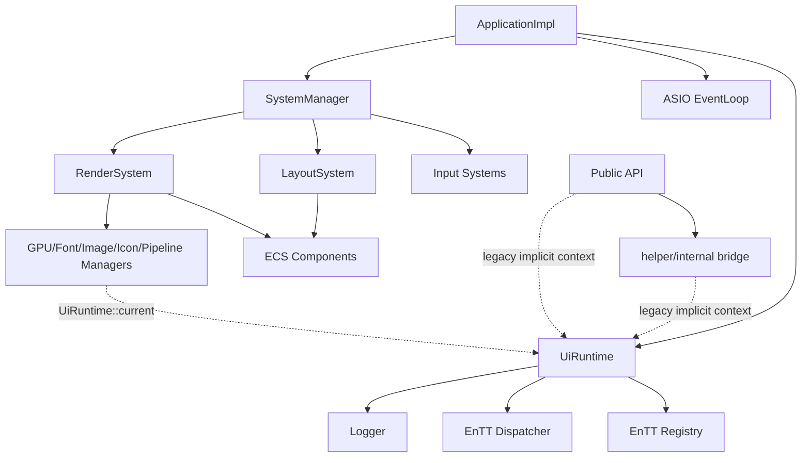
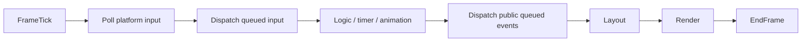
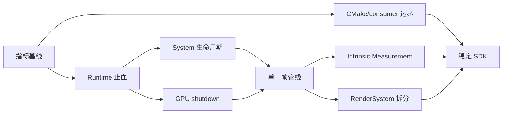

# VMP-ui 架构锐评与演进路线（2026-07-11）

> 状态：active（Phase 0 已完成；Phase 1 分项推进；WP3 最终 SDK 边界收紧仍受公共头依赖阻塞）
> 范围：公开 API、Runtime、事件与帧循环、System、布局、渲染、资源生命周期、CMake、测试与文档治理
> 原则：先消除确定性风险，再收敛执行模型，最后建设扩展能力。

## 0. 进度总览（代码核验于 2026-07-16）

### 0.1 状态口径

- `completed`：实现、测试和验收条件均已闭环。
- `active`：已有实质实现，但仍存在明确未完成项，不能按完成计。
- `blocked`：已有部分工作，但后续被明确前置决策或依赖阻塞。
- `not-started`：目标能力尚未实现；已有邻近基础设施不计为该工作包完成。
- “完成度”仅用于路线图管理，是按本工作包交付项估算的实现进度，不代表测试覆盖率，也不替代验收条件。

### 0.2 一眼可见的结论

- **已完成：2 项**——Phase 0 架构基线、WP2 System 连接生命周期。
- **正在推进：4 项**——WP1、WP4、WP5、WP7。
- **部分完成但受阻：1 项**——WP3，公共头迁移已有成果，但最终 SDK/CMake 边界仍未闭环。
- **尚未形成目标能力：2 项**——WP6、WP8；它们只有局部基础或前置铺垫。
- **尚未开始且受前置阻塞：1 项**——WP9。

### 0.3 工作包进度看板

| 阶段 / 工作包 | 状态 | 估算完成度 | 已经做了 | 明确没有做 / 未验收 |
| --- | --- | ---: | --- | --- |
| Phase 0：架构基线 | **completed** | **100%** | 静态门禁已统计 `UiRuntime::current()`、PUBLIC include/link 和 queued-event 派发点；`FrameContext` 已记录每调度帧 Layout/Render update 次数；`test_TaskChain.cpp` 覆盖常规帧、即时追加和下一帧复位 | 无剩余交付项；指标继续作为后续工作基线保留 |
| WP1 Runtime 与失败路径 | **active** | **65%** | 已有 `UiRuntime::tryCurrent()`；Runtime 构造不再切换 current；`UiRuntimeScope` 支持嵌套恢复；活动 Runtime 异常提前销毁会清除 stale current；`ApplicationImpl` 持有长期 scope；`CreateApplication()` catch 使用 stderr 后备路径；已有 5 个 Runtime 定向测试 | **没有** SDL 初始化失败注入测试；**没有**统一定义无 active Runtime 时所有 legacy API 的失败行为；非 Application 代码仍大量调用 `UiRuntime::current()` |
| WP2 System 连接生命周期 | **completed** | **100%** | 已建立 `ASSEMBLING / REGISTERED / STOPPED` 状态机；register/unregister 在 manager 层幂等；`removeSystem()` 在 REGISTERED 状态下先 unregister 再 erase；注册后追加明确返回 `false`；manager 级测试覆盖 phase 排序、重复注册/注销、移除后事件不再触发、追加拒绝及全部 12 个内建 System 的 phase 契约 | 无剩余交付项；后续新增内建 System 必须同步更新 phase 契约测试 |
| WP3 构建与 SDK 边界 | **active** | **85%** | `src/detail/` 已清零；多批公共头及 Animation/Image/Table 已迁入 `include/`；已落地无第三方依赖的 `Color`、`Vec2`、`Rect`、Callback、Geometry DTO 和 TweenOptions；Canvas/Controls/Factory/Utils 的公开头已移除 `common/Types.hpp` 直接依赖；Eigen 运算边界使用显式转换；独立 MathTypes header check 无需 Eigen | **没有**迁移 Canvas/Controls/Factory/Utils 的物理头路径；**没有**完成 Types.hpp 其余职责拆分；**没有**收紧 PUBLIC include/link；**没有**独立 install/export consumer |
| WP4 GPU shutdown | **active** | **70%** | 渲染实现已物理拆分；Application 保证 RenderSystem 先于 `SDL_Quit()`；首窗 claim 后锁定 device/backend；`ImageManager` 使用创建 device 绑定的 RAII owner；固定三节点事务统一初始化失败回滚与重复 cleanup；独立 offscreen/software 集成测试已连续三轮完成每轮 100 次真实窗口创建/关闭 | **没有**完整的 `RenderResourceContext` 所有权边界；fallback 100 次基线不等于真实 GPU 生命周期；**没有**真实 GPU 初始化失败注入、资源代际 token 和真实 GPU 100 次窗口验收；device 外部先行失效仍缺少类型级保护 |
| WP5 单一帧管线 | **active / partial** | **30%** | `TaskChain`、System phase 和帧次数埋点提供了局部顺序及观测基础；公开 `Enqueue()` 已在 `QueuedTask` 的 Timer/内部 buffered events 后、Layout/Render 前自动派发；生产路径恰有一个派发点，递归入队延后一帧且多 Runtime 隔离已有测试 | **没有**唯一 `FrameTick`；Task 内节流尚未统一为 scheduler policy；即时 Layout/Render 补救点尚未形成白名单；输入延迟和全管线单帧约束尚未完整验收 |
| WP6 Intrinsic Measurement | **not-started** | **0%** | 无本工作包目标实现 | **没有** `IntrinsicMeasureService`；`LayoutSystem.cpp` 仍使用 `content.length() * 8 + 10` 估宽和固定 `SCROLLBAR_GUTTER = 14`；CJK/emoji/shaped metrics 验收未做 |
| WP7 RenderSystem 拆分 | **active / partial** | **25%** | 已拆出 `RenderBackend.cpp`、`RenderResources.cpp`、`RenderFrame.cpp`；已有 `RendererRegistry` 基础 | **没有**真正的 `RenderResourceContext` 和 `RenderPipeline` 类型；`RenderSystemImpl` 仍直接持有 9 类 manager/backend、渲染队列和资源；renderer 分派尚未收敛为唯一机制 |
| WP8 API 版本化 | **not-started / foundation** | **15%** | 已有 `ui::entity`、`EntityHandle` 和部分 runtime-bound Factory 重载，公共头迁移提供了基础 | **没有**稳定的 runtime-bound handle 生命周期契约；**没有**裸 entity API 的 `[[deprecated]]` 标记、迁移周期和版本化文档；公开 API 尚未收敛到 `EntityHandle` |
| WP9 构建与发布矩阵 | **blocked / not-started** | **0%** | 仅验证当前 Windows clang-cl Debug 工作树构建 | 项目根目录 **没有** CMake Presets；**没有** UI 库 install/export/package consumer；**没有** Windows/Linux、MSVC/clang-cl/clang/gcc 持续矩阵；需等待 WP3 边界闭环 |

### 已完成的边界迁移批次

| 批次                  | 状态      | 结果                                                                                  |
| --------------------- | --------- | ------------------------------------------------------------------------------------- |
| detail/helper 收敛    | completed | `src/detail/` 清零；内部适配集中到 helper；门禁禁止 detail 文件回归                 |
| 首批公共 API 头       | completed | Entity、Event、Scale、State、Theme、Timer 迁入`include/ui/api/`                     |
| DSL 公共 API 头       | completed | Chains、Hierarchy、Log 迁入`include/ui/api/`                                        |
| 叶子公共 API 头       | completed | Animation、Icon、Image、Layout、Query、Size、Table、Visibility、Text 迁入 `include/ui/api/`；旧路径删除并纳入回归门禁 |
| 公共 Callback 解耦    | completed | 新增 `ui::Callback`；Controls/Text 公开签名移除内部 component callback 依赖          |
| 滚动条几何 DTO        | completed | 新增无 EnTT/Eigen 依赖的公共标量几何类型；移除伪 component DTO，保持原计算与命中语义 |
| TweenOptions 公共化   | completed | 权威定义迁至 `include/ui/TweenOptions.hpp`；旧内部头仅兼容转发，默认值和布局契约不变      |
| Error / Result 公共化 | completed | 权威头位于`include/ui/`；`src/common` 仅兼容转发；公共头禁止旧路径                |
| Policies 公共化       | completed | 权威头位于`include/ui/Policies.hpp`；位运算单点提供；内部 traits 不再重复注入运算符 |
| Ninja 构建限流        | completed | 默认 compile pool=2、link pool=1；默认高并发 clang-cl OOM 已止血                      |

**当前主线：** WP2 已完成，WP5 已启动并完成 public queued event 固定阶段的最小批次。下一优先级是继续 WP3 的公共类型解耦、收敛 WP4 的统一 GPU shutdown，并在后续 WP5 批次建立唯一 FrameTick。
`Vec2`/`Rect` 自有公共值类型已落地，Animation/Image/Table 物理头已迁移；下一批可按依赖面逐个迁移 Canvas/Controls/Factory/Utils
的物理头路径；在全部公共头闭包和独立 consumer 验收前不强行收紧 CMake PUBLIC 传播。WP5～WP9 目前都不能标记为已完成。

## 1. 执行摘要

VMP-ui 已越过“Demo 工程”阶段：C++23、ECS、`Result<T>`、GPU RAII、公开实体句柄、测试分组和架构边界检查均已有实质投入。但它仍处在一次未完成的架构迁移中：**表面上从全局单例迁到了 `UiRuntime`，实际依赖图仍大量依靠 `UiRuntime::current()` 这一线程局部 Service Locator。**

最尖锐的评价是：

1. **Runtime 显式化只完成了一半。** System 构造侧开始注入依赖，API、helper、manager、renderer 及部分 System 实现仍在隐式取全局上下文。
2. **RAII 解决了“谁释放”，没有彻底解决“何时释放”。** GPU deleter 捕获裸 device，资源销毁顺序仍靠人工纪律；代码甚至保留 device 先销毁后主动泄漏缓存的分支。
3. **帧循环不是一条管线，而是多个计时器、队列和即时补救路径的叠加。** System phase 只排序注册，不等于显式执行图。
4. **公开头的隔离方向正确，CMake 却仍把 EnTT 和内部 include 路径向消费者传播。** 源码边界在收，构建边界仍开着。
5. **文档多但状态漂移严重。** 一些计划已部分完成，一些规则仍匹配旧路径；继续堆计划会制造“文档看似治理、实际误导决策”。

当前不应优先扩充控件数量。未来 1～2 个版本的主线应是：**Runtime 生命周期 → 资源 shutdown → 单一帧管线 → 布局测量边界 → SDK/consumer 边界。**

---

## 2. 当前架构判断

### 已经做对的部分

- `include/ui.hpp` 已形成统一公开入口，公开事件与实体句柄开始隔离 EnTT。
- `include/ui/Result.hpp` 基于 `std::expected`，错误码、上下文和 `source_location` 设计成熟；`src/common/Result.hpp` 仅保留兼容转发。
- System 具备 phase 排序，注册模式统一。
- GPU 资源已有 RAII wrapper，不再完全依赖散落的手工 release。
- 测试已拆分 unit/ecs/api，存在公开头和公开事件测试。
- `tools/check_architecture_boundaries.py` 说明项目已认识到“边界需要机器约束”。

### 尚未闭环的部分

- Runtime 既是服务容器、所有者，又是 thread-local locator 和 registry context 宿主；API、helper、manager、renderer、system 仍存在隐式访问。
- 新旧 Factory API 并存，错误模型和 runtime 绑定不同。
- 主 Dispatcher 与公开自定义事件队列是两套系统。
- Layout 与 Render 虽没有直接类依赖，却通过文字估宽、滚动条魔法常量等语义耦合。
- RenderSystem 仍承担事件协调、资源所有权、缓存、管线和提交等过多职责。
- CMake PUBLIC 传播范围与“稳定 SDK 边界”目标不一致。

---

## 3. 风险清单与锐评

## 3.1 P0：初始化失败时可能二次崩溃

**证据：**

- `src/core/UiRuntime.hpp` 的 `current()` 直接解引用当前指针。
- `ApplicationImpl` 构造失败时，已构造成员会析构，Runtime 可能先清空 current。
- `src/api/Factory.cpp` 的 `CreateApplication()` 捕获异常后仍通过 `UiRuntime::current()` 记录错误。

**评价：** 错误处理路径依赖已经失效的错误处理环境，是典型的“为记录失败而再次失败”。这是确定性缺陷，不是设计偏好。

**建议：**

- 增加 `UiRuntime::tryCurrent() noexcept`。
- 初始化边界把异常一次性转换为 `Result`，catch 中使用不依赖 Runtime 的后备日志。
- 增加 SDL 初始化失败注入测试。

## 3.2 P0：`UiRuntime::current()` 是换了名字的全局单例

**证据：**

- `UiRuntime` 构造时覆盖 current，析构时清空，却不恢复之前的 Runtime。
- `UiRuntimeScope` 才具备保存/恢复的栈语义。
- API、detail、manager、renderer 等多层仍调用 `UiRuntime::current()`。

**评价：** 当前设计宣称“Runtime 化”，但多 Runtime、嵌套测试和同线程多 Application 的契约均不可靠。若继续让 current 扩散，未来每次拆模块都会受隐式环境牵制。

**建议：**

- 只有 `UiRuntimeScope` 能切换 current；Runtime 构造/析构不隐式抢占。
- 旧 API 可暂留 current 兼容入口，但新增代码禁止依赖它。
- manager/render 注入窄依赖（如 logger、resource context），不要引入重量级 DI 容器。

## 3.3 P0：System 移除可能留下悬挂事件连接

**证据：** `SystemManager::removeSystem()` 直接 erase；注册后的 Dispatcher 连接未必先注销。`addSystemBeforeRegister()` 又只是别名，生命周期状态没有显式建模。

**评价：** 对象销毁了，回调还可能认为对象活着；这是潜在 UAF。CRTP 与 `entt::poly` 的组合没有消除生命周期复杂度，反而增加了必须人工遵守的契约。

**建议：**

- 移除前强制 unregister。
- 建模 `ASSEMBLING / REGISTERED / STOPPED` 状态。
- 禁止注册后静默追加；明确重复注册/注销是否幂等。
- 若内建系统集合长期固定，评估静态 tuple；不要为不存在的插件场景长期支付类型擦除成本。

## 3.4 P0：GPU RAII 仍受裸 device 生命周期支配

**证据：**

- `src/common/GPUWrappers.hpp` 的 deleter 捕获裸 `SDL_GPUDevice*`。
- `ImageManager` 已用保存创建 device 的 `UniqueGPUTexture` 持有缓存纹理，但 wrapper 的 deleter 仍捕获裸 `SDL_GPUDevice*`。
- `RenderSystemImpl` 同时拥有多类 manager/cache/backend，清理顺序依赖手工约定。

**评价：** ImageManager 的裸所有权和主动泄漏已止血，但仍未形成完整生命周期闭包。类型系统没有保证 device 一定晚于所有资源 owner 销毁，外部失效或后续成员重排仍可能打破隐藏契约。

**建议：**

- 先建立并测试统一、幂等的 `RenderResourceContext::Shutdown()`。
- 明确资源依赖 DAG，所有 GPU owner 必须先于 DeviceManager 清理。
- 中期在 deleter 中持有可检测失效的 lifetime token/shared state。
- 覆盖初始化中途失败、重复 cleanup、窗口循环重建和 fallback 切换。

## 3.5 P0：源码边界与 CMake 边界互相打架

**证据：**

- `src/CMakeLists.txt` 将 `EnTT::EnTT`、Eigen、spdlog 作为 PUBLIC 链接依赖。
- `${CMAKE_SOURCE_DIR}` 与源码目录作为 PUBLIC include path 暴露。
- `include/ui.hpp` 已努力避免公开 EnTT 类型，现有计划也要求 EnTT PRIVATE。

**评价：** 消费者即使没有在公开签名中看到 EnTT，也会从 target usage requirements 得到内部依赖和内部头访问权。所谓“私有实现”尚未在构建系统中成立。

**建议：**

- EnTT 改 PRIVATE；测试按需显式链接。
- PUBLIC include 仅保留稳定公开目录。
- Eigen/spdlog 是否 PUBLIC 必须以公开签名为依据。
- 增加真正独立的 install/export consumer 编译测试。

## 3.6 P1：帧循环是一组偶然协作的节流器

**证据：**

- EventLoop 线程按约 16 ms 投递。
- loop 内还存在 `SDL_Delay(1)`。
- InputTask 再按 32 ms 节流，RenderTask 再按 16 ms 节流。
- 同时存在 `trigger`、`enqueue/update`、定向 update 和平台即时布局/渲染补救。

**评价：** 当前没有唯一 frame clock。输入延迟、阻塞后补帧、同帧布局次数和 buffered 事件阶段均难以严格推理。`SystemPhase` 只是连接顺序，不是执行计划。

**建议管线：**

节流应成为 scheduler policy，而不是散落在 Task 私有字段中。

## 3.7 P1：公开事件的 `Enqueue` 未必意味着“下一帧”

**证据：** `src/detail/` 已清零；公开事件 callback/queue 当前位于 `src/helper/Helper.hpp` 的
`ui::detail::event_bridge`，由 `src/api/Event.cpp` 转发。主帧路径仍未调用公开事件的
`DispatchQueued()`，因此 `Enqueue()` 不会自动形成明确的“下一帧派发”契约。

**评价：** 两套 buffered event 语义对使用者不可见，API 名称却暗示相同行为。这是契约歧义。

**建议：** 若承诺下一帧派发，将公开队列接入固定 frame stage；否则重命名并明确要求手动 dispatch。补充 disconnect-during-dispatch、递归 trigger 和异常策略测试。

## 3.8 P1：Layout 不 include Render，不代表真正解耦

**证据：** `LayoutSystem.cpp` 包含固定 scrollbar gutter、默认叶节点尺寸及 `content.length() * 8 + 10` 的文字宽度估算。

**评价：** CJK、emoji、组合字符和字体变化会直接击穿该估算。布局层已经知道视觉实现细节，只是耦合从类型层转移到了魔法常量层。

**建议：** 引入窄 `IntrinsicMeasureService`：Text 使用 shaped metrics，Image/Icon 使用固有尺寸，控件使用 theme metrics。Scrollbar thickness 从主题 metric 读取，不抽象整个 Yoga。

## 3.9 P1：RenderSystem 是被注释承认、但尚未处理的 God Object

**证据：** `RenderSystemImpl` 同时协调 device、字体、图标、图像、pipeline cache、text cache、batch、command buffer 和 backend。

**评价：** 继续新增 renderer 会让“接入一个控件”变成“修改中央总管”。若 `RendererRegistry` 与硬编码分派并存，还会形成双轨扩展机制。

**建议：** 只拆两个稳定职责：

1. `RenderResourceContext`：资源所有权、初始化和 shutdown；
2. `RenderPipeline`：collect、sort、batch、submit。

`RenderSystem` 只保留事件订阅和窗口生命周期协调。`RendererRegistry` 要么真正成为唯一入口，要么删除。

## 3.10 P1：错误基础设施成熟，错误政策却不统一

**证据：** 同时存在 `Result<T>`、初始化异常、裸 bool/nullptr、日志后失败和析构 catch-all；README 对错误类型的描述也已过时。

**评价：** 缺的不是新错误框架，而是“一类错误由谁转换、由谁记录”的边界。

**建议策略：**

- 公开边界及可恢复 I/O：`Result<T>`；
- programmer error：assert/contract；
- 构造器内部可抛，但只在最外层转换一次；
- 析构必须 noexcept；
- 错误只在最终消费边界记录，避免重复日志。

## 3.11 P2：架构门禁与文档已发生状态漂移

**证据：** 门禁已覆盖 `src/detail/*` 回归、已迁移 API 旧路径和公共错误头旧路径；2026-07-15 已将过时的
`RuntimeFacade::current()` 规则替换为真实 `UiRuntime::current()` 基线，并增加 PUBLIC include/link 与 queued event
生产派发点指标。`FrameContext` 已补充调度帧序号及 Layout/Render update 次数，`QueuedTask` 在 buffered event
派发前开帧并复位计数，两个 System 在 early return 前记录入口调用；README 与部分 todo 对当前实现描述也已过时。

**评价：** 失真的门禁比没有门禁更危险，因为它制造“检查已通过”的虚假安全感。

**建议：** 给所有架构计划增加 `proposed / active / completed / superseded` 状态；更新门禁以统计当前 `UiRuntime::current()`、PUBLIC include、EnTT 传播和 API 内部头依赖，基线只能下降。

---

## 4. 优先级与风险矩阵

| 优先级 | 工作项                              | 不处理风险                       | 变更风险 |
| ------ | ----------------------------------- | -------------------------------- | -------- |
| P0     | 修复 Application 初始化失败二次崩溃 | 初始化失败直接崩溃               | 低       |
| P0     | 固化 Runtime/current 生命周期契约   | 多 Runtime、测试隔离、析构不确定 | 中       |
| P0     | System 移除前注销                   | 悬挂回调、UAF                    | 低       |
| P0     | GPU shutdown 顺序与故障测试         | 泄漏、悬空 device、重建失败      | 中       |
| P0     | 收紧 EnTT 与内部 include 传播       | 私有实现成为事实公共 API         | 中       |
| P1     | 统一帧时钟与事件阶段                | 输入延迟、乱序、难复现卡顿       | 中高     |
| P1     | 公开事件接入帧循环                  | `Enqueue` 契约不符合预期       | 低中     |
| P1     | 固有尺寸测量服务                    | CJK/emoji/字体布局错误           | 中       |
| P1     | 拆 RenderResourceContext/Pipeline   | God Object 持续膨胀              | 中高     |
| P1     | 收敛新旧公开 API                    | Service Locator 永久化           | 中       |
| P1     | 更新架构门禁                        | 新债无法被 CI 发现               | 低       |
| P2     | consumer/install/package 验证       | 外部集成阶段才暴雷               | 中       |
| P2     | 调度、布局、生命周期集成测试        | 高风险回归依赖手测               | 中       |
| P2     | 文档状态治理                        | 重复规划、错误决策依据           | 低       |

---

## 5. 路线图

## Phase 0：建立基线（2～3 天）

**当前状态：completed。** 静态边界基线已固化并由门禁执行；初始快照为 `UiRuntime::current()` 305 处、PUBLIC 内部 include 路径 2 项、PUBLIC 内部依赖 3 项、queued event 生产帧派发点 0 处。当前指标已推进为 302 / 2 / 3 / 1。运行时侧由 `FrameContext` 记录单调递增的调度帧序号与当帧 Layout/Render update 入口次数；任务链测试已覆盖常规刷新各一次、同帧即时 Render 追加以及下一调度帧复位。该指标统计 System update 调用，不等同于 Yoga root 数或 GPU present 数。

**目标：** 在改架构前先让债务可计数。

- 统计 `UiRuntime::current()` 的总量及按目录分布。
- 记录 PUBLIC include/link 传播项。
- 记录每帧 Layout/Render 次数和公开 queued event 派发点。
- 为现有 `docs/todo` 标记状态，过时文档不再作为实施依据。

**验收：** CI 输出架构指标；新增债务会失败或至少显式告警。

## Phase 1：止血并固化生命周期（1～3 周）

### WP1 Runtime 与失败路径

**当前状态：active。** 第一轮止血已完成：`tryCurrent()` 已提供；Runtime 构造不再隐式修改 current，异常提前销毁活动 Runtime 时析构会清除 stale TLS 指针；`ApplicationImpl` 通过长期 `UiRuntimeScope` 绑定 legacy API；`CreateApplication()` catch 已改用不依赖 Runtime 的 stderr 后备日志。当前仍需清理非 Application 内部的隐式访问，并补 SDL 初始化失败注入测试。

- ~~增加 `tryCurrent()`；修复 `CreateApplication()` catch。~~ 已完成。
- ~~current 仅由 `UiRuntimeScope` 切换。~~ Application 生命周期已接入；其余旧调用点继续按基线下降。
- 定义无 active Runtime 时兼容 API 的失败行为。

**验收：**

- SDL 初始化强制失败返回 `Result` 且不崩溃。
- 嵌套两个 scope 后 current 逐层恢复。
- 无 scope 调用被测试覆盖，不再产生未定义解引用。

### WP2 System 连接生命周期

**当前状态：completed。** `SystemManager` 已建立 `ASSEMBLING / REGISTERED / STOPPED`
状态机；重复 register/unregister 在 manager 层为 no-op；REGISTERED 状态下 `removeSystem()` 会先注销目标 System
再删除；注册后调用 `addSystem()` / `addSystemBeforeRegister()` 会返回 `false`。新增 manager 级测试已覆盖 phase
排序、幂等、remove-before-unregister、移除后不再接收事件、追加拒绝，以及全部 12 个内建 System 的逐项
phase 契约。

- ~~增加 manager 状态机。~~ 已完成。
- ~~remove 前 unregister；禁止注册后静默追加。~~ 已完成。
- ~~覆盖重复注销和移除后触发事件。~~ 已完成。
- ~~补充全部内建 System 的逐项 phase 契约测试。~~ 已完成。

**验收：** 无悬挂回调；全部内建 system 的 phase 顺序有测试。

### WP3 构建与 SDK 边界

**当前状态：blocked / active。** 多批公共头迁移和公共 callback 解耦已经完成；最终 CMake 收紧仍被剩余 `src/api`/`src/common`、Eigen 公共类型和独立 consumer 缺失阻塞。

- EnTT PRIVATE；PUBLIC include 仅公开目录。
- 区分内部 API 测试和独立 consumer 测试。
- 更新当前路径和符号对应的架构门禁。

**验收：** 独立 consumer 不需要 EnTT include path；公开头检查与现有测试全部通过。

### WP4 GPU shutdown

**当前状态：active。** 渲染源码已初步拆分；ImageManager 主动泄漏已消除，cleanup 已统一资源先于 device 的顺序，但独立资源上下文和真实 GPU 生命周期验收尚未完成。

Application 生命周期 P0 止血已完成：新增私有 `ApplicationLifecycle` 协调器，仅在 `SDL_Init()` 成功后接管
`SDL_Quit()`。正常析构显式断开 Application 回调并注销 System handler，随后通过幂等 `Shutdown()` 执行
`m_systems.reset()`，确保其中的 RenderSystem/GPU 资源先于 SDL 会话退出；若 SDL 初始化后的任一步构造抛出，
成员逆序展开同样先销毁 SystemManager，再由协调器恰好回滚一次 SDL。测试覆盖未 armed 不退出、构造失败回滚一次、
systems-before-quit、重复 shutdown 以及系统销毁步骤抛出后仍执行 quit。本批没有解决 device 已失效时的资源 deleter、
backend 切换或 manager 主动泄漏问题。

最小设备锁定批次已完成：新增纯状态 `DeviceClaimState`，将“首个窗口成功 claim”设为 device/backend 锁定点。
`ensureInitialized()` 现在只建立候选 device、字体和 fallback 基础；PipelineCache/shader、TextTextureCache、CommandBuffer
和 renderer 延后到成功 claim 后创建，因此首窗 backend fallback 销毁候选 device 时尚无旧 device 资源。`DeviceManager`
在已有成功 claim 后遇到新窗口失败会直接返回错误，不再 cleanup 或切换全局 device；frame 补救路径在 claim 失败后立即
跳过窗口，不再继续创建 pipeline，white texture 也只在设备锁定且资源 ready 后创建。该批消除了“资源创建后静默切换
device”的根因，但没有为 GPU wrapper 增加资源代际 token，也没有解决外部原因导致 device 先行失效时的防御性释放。

ImageManager 纹理 RAII 批次已完成：缓存 value 和私有解码/上传链改用现有 `UniqueGPUTexture`，公开 API 继续只返回
借用裸指针；纹理和上传缓冲的失败路径由 owner 自动回收，`releaseAll()` 仅清空 owner 容器，不再查询当前 device、
手工释放或主动泄漏。RenderSystem cleanup 已合并 device-null 分叉，统一在 `DeviceManager::cleanup()` 前销毁 manager、
cache、renderer、command buffer、white texture 和 pipeline，并在末尾复位 `DeviceClaimState`。纯 fake-deleter 测试验证
创建 device 绑定、move 唯一所有权、容器 clear 恰好一次释放及空 owner 行为；本批未启动真实 SDL/GPU。

初始化回滚批次已完成：新增不依赖 SDL/EnTT/Runtime 的固定三节点事务，严格按
`PipelineCache -> TextTextureCache -> CommandBuffer` 提交，并在失败或 shutdown 时按逆序各清理一次。
`PipelineCache::loadShaders()` 已返回内部 `Result<void>`，shader 缺失不再只记录日志后继续进入 resources-ready；
初始化失败进入 failed 状态，避免每帧无界重试。正常 cleanup 与失败回滚复用事务入口，清理 visitor 抛出时仍继续
处理剩余节点。8 项纯逻辑测试覆盖成功、三处失败、乱序提交、失败后禁止重试、未开始 shutdown、重复 shutdown 和
清理异常隔离；测试未启动真实 SDL/GPU。

Fallback 窗口生命周期基线已完成：新增独立 `ui_fallback_lifecycle_tests` 进程，固定 SDL `offscreen` video driver
并通过 `--backend=cpu` 强制进入 software fallback。单次测试顺序完成 100 次 runtime-bound Window 创建、真实
software renderer 初始化、CloseWindow 定向派发、ECS entity 失效和 SDL window 销毁，Application 析构后验证
SDL video 已退出；该测试连续独立运行三轮均通过。该批真实使用 SDL/offscreen/software renderer，但没有创建
`SDL_GPUDevice`，因此仅作为 fallback 生命周期基线，不替代真实 GPU 100 次验收。

- 绘制资源 DAG，将清理集中到幂等入口。
- 覆盖中途初始化失败、重复清理、窗口循环创建销毁。

**验收：** 连续创建销毁 100 次稳定；正常路径不再以“主动泄漏”收尾。

## Phase 2：统一执行模型（1 个版本）

### WP5 单一帧管线

**当前状态：active / partial。** 局部阶段顺序已经存在，public queued event 已接入固定阶段，但尚未形成唯一 FrameTick。

- 建立唯一 `FrameTick` 和固定阶段。
- 移除 Task 内散落的 16/32 ms countdown。
- [x] 将 public queued events 接入固定阶段：`QueuedTask` 在 Timer 和内部 buffered events 后、Layout/Render 前自动派发；递归入队延后一帧，多 Runtime 不串队列。
- 对必要的即时补救点建立白名单及原因说明。

**验收：**

- 输入附加延迟不超过一帧。
- 默认每帧 Layout/Render 最多一次。
- 所有 queued event 的阶段可测试、可追踪。

### WP6 Intrinsic Measurement

**当前状态：not-started。** 尚无独立测量服务，估宽与固定 gutter 仍待替换。

- Text/Image/Icon/自定义控件通过窄接口提供固有尺寸。
- 删除字符串长度估宽。
- 滚动条尺寸改由 theme metric 提供。

**验收：** CJK、emoji、组合字符与 shaped metrics 在明确容差内一致；Layout 不依赖具体 renderer/manager。

## Phase 3：收敛渲染职责（1 个版本）

### WP7 RenderSystem 拆分

**当前状态：active / partial。** Backend、Resources、Frame 已有物理拆分，职责和所有权仍集中在 RenderSystem。

- 建立 `RenderResourceContext`。
- 建立 `RenderPipeline`。
- 统一 renderer 注册/分派机制。
- GPU 与 CPU fallback 共享可测试的数据阶段。

**验收：**

- `RenderSystemImpl` 不再直接持有大量散列 manager。
- 新 renderer 接入无需修改中央分派。
- fallback 与 GPU 至少共享 collect/sort/batch 测试。

## Phase 4：稳定 SDK 与发布闭环（2～4 个版本）

### WP8 API 版本化

**当前状态：not-started。** 已有句柄与公共头基础，尚未形成版本化和废弃契约。

- 稳定入口收敛到 runtime-bound `EntityHandle`。
- 裸 entity API 进入明确废弃周期。
- 公开事件、错误、句柄生命周期形成契约文档。

### WP9 构建与发布矩阵

**当前状态：blocked。** 依赖 WP3 完成独立 consumer 和 install/export 边界闭环。

- CMake Presets 覆盖 MSVC、clang-cl、Linux clang/gcc。
- 完成 install/export/package consumer 验证。
- 增加 integration/headless、布局 golden、资源生命周期和性能烟雾测试。

**验收：** 至少两平台、三编译器配置持续通过；发布产物可被独立工程消费。

---

## 6. 量化指标

| 指标                            |         基线 |                     目标 |
| ------------------------------- | -----------: | -----------------------: |
| `UiRuntime::current()` 调用数 |          305 | 每版本单调下降；新增为 0 |
| PUBLIC 内部 include 路径        |            2 |                        0 |
| PUBLIC 内部依赖传播             |            3 |                        0 |
| EnTT 对 consumer 传播           |            1 |                        0 |
| 正常可达主动泄漏分支            |     当前存在 |                        0 |
| 默认单帧 Layout 次数            | 常规刷新帧 1 |                     ≤ 1 |
| 默认单帧 Render 次数            | 常规刷新帧 1 |                     ≤ 1 |
| queued event 生产帧派发点       |            1 |                        1 |
| 窗口循环创建/销毁稳定次数       |       未固定 |                   ≥ 100 |
| 独立 consumer 构建              |       未闭环 |                  CI 必过 |
| 架构文档状态缺失                |         多处 |                        0 |

---

## 7. 明确不做

- 不引入完整 DI 容器；优先构造器注入和窄服务接口。
- 不在帧阶段尚未固定前引入通用任务图调度器。
- 不为了“架构纯洁”把每个 System 拆成多层接口。
- 不长期并存硬编码 renderer 分派和 `RendererRegistry` 两套机制。
- 不优先扩充更多控件来掩盖生命周期、焦点、事件和帧管线问题。
- 不照搬旧 todo；先核对代码现状和文档状态。

---

## 8. 决策门

**状态：已决策（2026-07-17）。** 以下产品级选择已经确认，不再作为 Phase 2～4 的前置阻塞项。

| 决策项 | 已确认结论 | 对后续实施的约束 |
| --- | --- | --- |
| 同线程多 Application / 多 Runtime | **支持** | Runtime/current 生命周期必须具备嵌套、逐层恢复和实例隔离语义；不得以“进程内仅一个 Application”为前提简化资源、事件或公开句柄生命周期。 |
| `ui::event::Enqueue()` 派发语义 | **承诺自动在下一帧固定阶段派发** | WP5 必须将公开 queued event 接入唯一 FrameTick；手动 dispatch 只能作为显式测试或高级控制入口，不能作为正常使用前提。 |
| 发布形态 | **同时支持源码内嵌静态库和可安装 SDK，由使用方选择** | WP3/WP9 必须同时保留静态嵌入构建，并完成 install/export/package consumer；两种模式应共享稳定公共头和一致的依赖可见性契约。 |
| CPU fallback 定位 | **正式后端** | fallback 必须纳入持续测试、生命周期、错误处理和功能契约；不得仅作为调试分支或 GPU 初始化失败后的临时兜底。 |
| 下一主版本公开实体 API | **允许收敛到 `EntityHandle` 并弃用裸 entity** | WP8 应为裸 entity API 制定明确的 `[[deprecated]]` 周期、迁移文档和 runtime token/句柄失效契约；新增公开 API 优先采用 runtime-bound handle。 |
| 数学类型与 Eigen 公共 ABI | **公开 API 不再暴露 Eigen；Eigen 仅用于内部运算并在边界显式转换** | WP3 应引入无第三方依赖、standard-layout、trivially-copyable 的自有 `ui::Vec2`/`ui::Rect`；公开头不得包含 Eigen 或以 Eigen alias 作为签名。内部可继续使用 Eigen 矩阵/向量，但仅在运算入口和结果出口转换；完成迁移后将 Eigen 从 PUBLIC 依赖收紧为 PRIVATE。 |

据此，Phase 2 可以直接按“唯一帧阶段自动派发 queued event”推进；Phase 3 必须将 CPU fallback
视为与 GPU 并列的正式渲染后端；Phase 4 同时验收源码内嵌和可安装 SDK，并允许在下一主版本完成
`EntityHandle` 收敛。后续规划不得重新以这些事项“尚未决策”为由阻塞实施；若需改变结论，必须新增带日期的
替代决策并说明兼容与迁移影响。数学类型决策于 2026-07-18 补充确认，直接解除 WP3 的产品决策阻塞；
实现仍需按独立工作包完成类型契约、转换边界、API 迁移和 consumer 验收。

---

## 9. 建议实施顺序

**一句话路线：先让失败可控、对象能安全死去、每帧行为可推理，再谈可插拔和 SDK 化。**

---

## 10. API / Helper 边界收敛进展（2026-07-11）

本轮已确立以下边界：

- 外部稳定入口为 `<ui.hpp>`；`src/api/*.hpp` 保持公共声明兼容，但不允许包含 EnTT、`helper/` 或 `detail/`。
- EnTT 实体转换及内部普通 helper 集中到 header-only `src/helper/Helper.hpp`，所有头内定义使用 `inline`。
- 公开 `ui::chains` DSL 保持兼容；内部 helper 不再复制链式 action 或 `operator|` 包装。
- API 的 `.cpp` 负责将公开 `ui::entity` 适配为内部 `entt::entity`，EnTT 原生依赖不进入公开头。
- 已迁移 EntityCast、Utils 内部重载、Size、Visibility、Layout、Hierarchy、Icon、Query、Theme、Event、Canvas、Animation、Controls、Table、Text。
  这里的“Animation”等表示内部实现/适配迁移完成，不表示同名公共头均已物理迁入 `include/ui/`。
- 已删除对应的 detail 实现与重复镜像头；架构检查已增加公共头禁止 EnTT/helper/detail 的规则。

`src/detail/` 已清零。最后五个文件均确认是过期公共镜像或未使用重复声明：`Factory.hpp` 的唯一调用改用权威 `api/Factory.hpp`，`Image.hpp`、`Log.hpp`、`Shortcut.hpp`、`Timer.hpp` 直接删除。架构门禁已增加 `src/detail/*` 禁止回归规则。

公开事件 callback/queue 目前仍通过 `src/helper/Helper.hpp` 内部的 `ui::detail::event_bridge` 适配。这里的 `detail` 是实现命名空间，不表示 `src/detail/` 物理目录仍然存在。

下一阶段的主要边界阻塞已不再是 detail，而是公共头仍物理位于 `src/api`/`src/common`：`include/ui.hpp` 依赖 PUBLIC 暴露整个源码目录，部分公共 API 还可达内部 component 头。因此，收紧 PUBLIC include path 和将 EnTT linkage 改为 PRIVATE，应在“公共头迁入 `include/ui/` + 公共 callback/type 与内部 component 解耦 + 独立 consumer 验证”工作包中完成，不能仅靠修改 CMake 可见性强推。

公共头物理迁移已启动，首批 `Entity.hpp`、`Event.hpp`、`Scale.hpp`、`State.hpp`、`Theme.hpp`、`Timer.hpp` 已迁入 `include/ui/api/`，旧 `src/api` 副本已删除，`ui.hpp` 与内部调用点已切换到新路径。架构门禁同时禁止这批头重新出现在 `src/api`。该批次保持构建和公开调用兼容。

尚未执行 CMake PUBLIC include 与 EnTT linkage 的最终收紧：剩余 API 头仍在 `src/api`，且部分公开签名仍引用位于 `src/common` 的 Eigen 值类型。`Controls.hpp`/`Text.hpp` 的 callback 解耦、Text 稳定头迁移和 `Utils.hpp` 的 scrollbar geometry 公共值类型已经完成。2026-07-18 已确认公开 API 不再暴露 Eigen，后续应落地自有 `Vec2`/`Rect` 并只在内部运算边界转换。

第二批公共 DSL 骨架迁移已完成：`Chains.hpp`、`Hierarchy.hpp`、`Log.hpp` 已迁入
`include/ui/api/`，旧 `src/api` 副本已删除。其余 API 头统一通过
`ui/api/Chains.hpp` 依赖公开 DSL 基础，源码、测试与 `ui.hpp` 对 Hierarchy/Log 的引用也已切换到
稳定公开路径。CMake 头列表和架构门禁已同步，禁止这三个旧路径回归。

第三批无内部类型叶子头迁移已完成：`Icon.hpp`、`Layout.hpp`、`Query.hpp`、`Size.hpp` 已迁入
`include/ui/api/`，实现文件和 `ui.hpp` 已切换到稳定路径，旧 `src/api` 镜像已删除。四个头只依赖 Entity、Chains、
Policies、Result 与标准库，不引入 EnTT、component、Runtime 或 Eigen；架构门禁已禁止旧路径回归，并新增稳定路径
编译测试。本批未触碰 `Types.hpp`/Eigen 的产品级公开类型决策，也未提前收紧 CMake PUBLIC 传播。

公共 callback 解耦批次已完成：新增独立公共头 `include/ui/Callback.hpp`，以
`std::move_only_function<void(Args...)>` 提供 `ui::Callback<Args...>`；`Controls.hpp`、`Text.hpp` 及其 DSL 的公开签名
不再包含或暴露 `common/components/Interaction.hpp` 和 `ui::components::on_event`。内部 `on_event` 暂时保留为
`ui::Callback` 的兼容别名，因此 move-only 语义、参数形式、转发方式和同步调用时机均未改变。架构门禁已禁止公开
API 头重新包含 `common/components/*`，测试同时验证公共类型与内部兼容别名保持同一具体类型。本批仍未迁移
Controls 头，因为其 `Callback<Vec2>` 公开签名继续受 `Types.hpp`/Eigen 决策阻塞；Color 已完成公共化，不再是 Text/Table 的阻塞项。

Text 公共头迁移批次已完成：`include/ui/api/Text.hpp` 直接依赖公共 `Callback`、`Color`、`Policies`、Entity 和
Chains，并显式包含 `<string>`/`<utility>`；不再通过 `common/Types.hpp` 引入 Eigen。旧 `src/api/Text.hpp` 已删除并
纳入门禁。函数、回调具体类型、DSL 和 move-only 语义均未改变。

纵向滚动条几何公共化批次已完成：新增 `include/ui/Geometry.hpp`，其中 `GeometryRect` 和
`VerticalScrollbarGeometry` 仅由 `bool`/`float` 组成，保持 standard-layout 与 trivially-copyable，不依赖 EnTT、Eigen、
component 或 Runtime。原 `common/components/Layout.hpp` 中带 `is_component_tag` 的伪组件定义已删除，Utils 生产者和
StateSystem 消费者统一使用公共 DTO；内部只在 Utils 实现边界把 Eigen `Rect` 拷贝为标量矩形。滚动条公式、最小 thumb、
inset、offset clamp、`visible` 置位时机以及矩形闭区间命中语义均保持不变。该批次没有迁移 `Utils.hpp`，因为其余
`GetAbsolutePosition()`、`GetEntityRect()` 等公开签名仍使用 Eigen `Vec2`/`Rect`。

本轮还针对 clang-cl 解析巨型 header-only Helper 时的高内存占用，为 Ninja 增加全局可配置任务池：
默认编译并发为 2、链接并发为 1。该措施避免默认按 CPU 核数启动大量重型翻译单元导致
`LLVM ERROR: out of memory`；它是构建稳定性止血，不能替代后续按领域降低 `Helper.hpp` include fanout。

Phase 0 静态架构基线已于 2026-07-15 落地到 `tools/check_architecture_boundaries.py`。门禁现在直接统计并
baseline 真实 `UiRuntime::current()`（当前 302 处）、PUBLIC 内部 include 路径（2 项）以及 EnTT/Eigen/spdlog
PUBLIC 依赖（3 项）；任何新增或基线过期都会失败。公开 queued event 在生产帧路径中的自动派发点当前为 1，
门禁要求该接入点恰好为 1。Phase 0 指标继续作为后续工作基线保留。

WP5 接入前执行快照（2026-07-17，Debug）：构建成功；架构门禁和公开头检查通过；PublicLeafHeaders/TweenSystem 定向测试 7 passed / 0 failed，全量测试 167 passed / 0 failed。新增测试验证 `TweenOptions` 的 standard-layout、trivially-copyable、四项默认值及旧路径兼容；架构门禁验证公共头不反向包含旧内部头且旧头保持纯转发。当时架构指标为 `UiRuntime::current()` 302 处、PUBLIC 内部 include 2 项、PUBLIC 内部依赖 3 项、生产帧 queued-event 派发点 0。
剩余公共头仍受 `src/common` Eigen 值类型以及 Factory/Runtime 边界阻塞；下一批应完成基础数学值类型决策，
不应直接强制收紧 PUBLIC include/link。

WP5 public queued event 固定阶段批次执行快照（2026-07-17，Debug）：构建成功；架构门禁和公开头检查通过；
TaskChain/PublicEvent 定向测试 13 passed / 0 failed，全量测试 170 passed / 0 failed。`QueuedTask` 现在显式激活其绑定
Runtime，并在 Timer 与内部 buffered events 后自动调用唯一的公开队列派发点；测试覆盖同步不触发、下一调度帧派发、
递归入队延后一帧和多 Runtime 隔离。架构指标为 `UiRuntime::current()` 302 处、PUBLIC 内部 include 2 项、
PUBLIC 内部依赖 3 项、生产帧 queued-event 派发点 1。唯一 FrameTick、Task 节流策略和即时补救白名单仍未完成。

WP3 Visibility 公共头迁移执行快照（2026-07-17，Debug）：`Visibility.hpp` 已迁至 `include/ui/api/`，直接依赖
`ui/Color.hpp` 而不再包含 `common/Types.hpp`；旧 `src/api/Visibility.hpp` 已删除并由架构门禁禁止回归。函数签名、
DSL 和运行时行为不变。构建、架构门禁与公开头检查通过；Visibility/PublicLeafHeaders 定向测试 26 passed / 0 failed，
全量测试 171 passed / 0 failed。指标保持 302 / 2 / 3 / 1。该批确认 Color 已完成公共化；剩余核心阻塞是
Vec2/Rect/Eigen ABI、独立 consumer 和 CMake PUBLIC 边界。

WP3 Text 公共头迁移执行快照（2026-07-18，Debug）：构建、架构门禁和公开头检查通过；
PublicLeafHeaders/MainWindow/ThemeSystem Button 定向测试 15 passed / 0 failed，全量测试 171 passed / 0 failed。
架构指标保持 302 / 2 / 3 / 1。下一低风险叶子候选是 Table；Controls/Animation/Canvas/Utils/Factory/Image 仍受
Vec2/Rect/Eigen 公共 ABI 决策约束。

错误基础设施公共化批次已完成：权威 `ErrorCodes.hpp`、`Result.hpp` 已迁入 `include/ui/`，
`src/common` 下保留兼容转发头，内部实现和测试已切换到稳定公共路径。架构门禁现已禁止公共头重新包含
`common/ErrorCodes.hpp` 或 `common/Result.hpp`。本批未改变 `UiErrc`、`Error`、`Result<T>`、`TRY` 宏或错误码数值，
因此保持源码兼容；这里的 completed 仅指头文件位置和依赖方向，异常、裸 `bool`/`nullptr` 等错误政策统一仍属后续工作。

Policies 公共化批次已完成：权威定义迁入 `include/ui/Policies.hpp`，不再依赖内部
`traits/PoliciesTraits.hpp`；`src/common/Policies.hpp` 仅保留兼容转发，全仓调用点已切换到 `ui/Policies.hpp`。
位运算和 `HasFlag` 现在由公共头单点提供，并仅允许实际 flags 类型；旧 traits 仍保留内部类型检测兼容，
但不再重复注入运算符。架构门禁已禁止公共头重新依赖 `common/Policies.hpp` 或 `src/traits`。

以上结果复用同一份 2026-07-16 Debug 执行快照，不代表 WP3、Runtime 或发布矩阵已经验收完成。
公共 `Vec2`/`Rect` 基础批次已完成。后续不得重新引入 Eigen alias 或隐式转换；应按公开头依赖复杂度逐个迁移
Canvas/Controls/Factory/Utils，并继续将 Eigen 运算限制在命名的内部转换边界。

WP3 公共 Vec2/Rect 与 Eigen 边界执行快照（2026-07-18，Debug）：新增 `include/ui/MathTypes.hpp`，固定 Vec2 两个
float、Rect 四个 float 的布局和最小运算契约；`common/Types.hpp` 已删除 Eigen Vec2 alias 与旧 Rect 权威定义。
Animation/Canvas/Controls/Factory/Image/Utils/Table 公开头不再直接包含 `common/Types.hpp`，RenderFrame、IconRenderer
和 Transform helper 在进入 Eigen 运算时显式 `ToEigen()`，StateSystem 使用 `LengthSquared()`。独立 MathTypes header
check 仅获得项目 `include/` 且无需 Eigen。Debug 构建、架构门禁和公开头检查通过；定向测试 70 passed / 0 failed，
全量测试 173 passed / 0 failed；指标保持 302 / 2 / 3 / 1。Eigen PRIVATE 化和独立 install/export consumer 仍待后续。

WP3 Image 公共头迁移执行快照（2026-07-18，Debug）：`Image.hpp` 已迁至 `include/ui/api/`，旧
`src/api/Image.hpp` 已删除并由门禁禁止回归；实现、umbrella header 和 CMake 公共头清单均使用稳定路径。
Image API 与 DSL 签名、资源加载行为均未改变。Debug 构建、架构门禁和公开头检查通过；PublicLeafHeaders
定向测试 7 passed / 0 failed，全量测试 173 passed / 0 failed，指标保持 302 / 2 / 3 / 1。下一低风险候选为 Table。

WP3 Table 公共头迁移执行快照（2026-07-18，Debug）：`Table.hpp` 已迁至 `include/ui/api/`，旧
`src/api/Table.hpp` 已删除并由门禁禁止回归；实现、umbrella header 和 CMake 公共头清单均使用稳定路径。
Table API、vector move 捕获和 Chain DSL 行为均未改变。Debug 全量构建、架构门禁、umbrella header 和公开头检查
通过；全量测试 173 passed / 0 failed，指标保持 302 / 2 / 3 / 1。剩余物理头候选为
Animation/Canvas/Controls/Factory/Utils，均需按依赖面继续拆分，不能据此提前收紧 PUBLIC include/link。

WP3 Animation 公共头迁移执行快照（2026-07-18，Debug）：`Animation.hpp` 已迁至 `include/ui/api/`，旧
`src/api/Animation.hpp` 已删除并由门禁禁止回归；Animation 实现、Factory 内部调用、umbrella header 和 CMake
公共头清单均使用稳定路径。公开函数、integral/enum 转发模板、EntityAction 与 Chain DSL 行为均未改变。
Debug 全量构建、架构门禁、umbrella header 和公开头检查通过；全量测试 173 passed / 0 failed，指标保持
302 / 2 / 3 / 1。剩余物理头候选为 Canvas/Controls/Factory/Utils；下一低风险候选是 Canvas，但应先补足最小公开契约覆盖。
